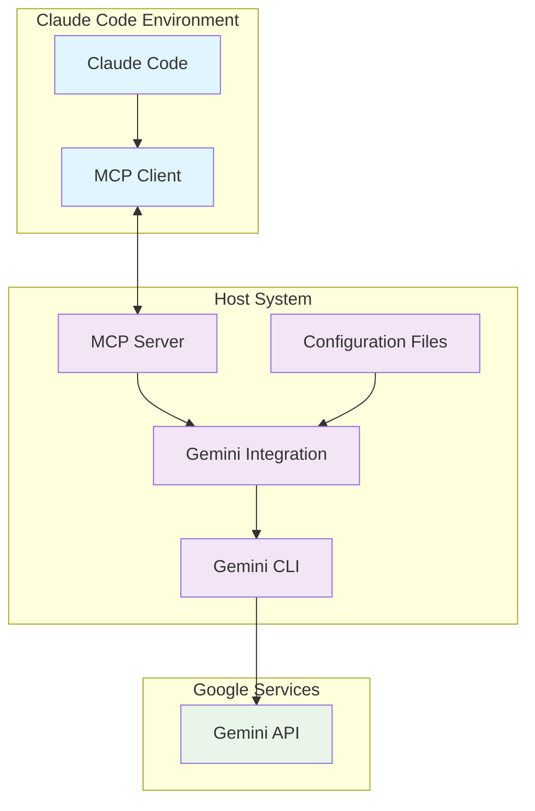

# Design Document

## Overview

Gemini MCP Integration은 Google Gemini CLI와 Claude Code를 연결하는 MCP(Model Context Protocol) 서버입니다. 이 시스템은 Claude의 응답에서 불확실성을 감지하여 자동으로 Gemini에게 두 번째 의견을 요청하거나, 사용자가 수동으로 상담을 요청할 수 있는 기능을 제공합니다.

핵심 설계 원칙:
- **호스트 기반 아키텍처**: 인증 호환성과 단순성을 위해 MCP 서버와 Gemini CLI 모두 호스트에서 실행
- **싱글톤 패턴**: 일관된 상태 관리와 속도 제한을 위한 단일 인스턴스 사용
- **비동기 처리**: 논블로킹 Gemini CLI 호출과 속도 제한 구현
- **패턴 기반 감지**: 정규식을 사용한 불확실성 및 복잡성 패턴 감지

## Architecture



### 주요 컴포넌트

1. **MCP Server** (`mcp-server.py`)
   - MCP 프로토콜 구현
   - 도구 등록 및 호출 처리
   - 설정 로딩 및 관리

2. **Gemini Integration** (`gemini_integration.py`)
   - 싱글톤 패턴으로 구현된 핵심 통합 모듈
   - 패턴 감지 및 Gemini CLI 호출
   - 속도 제한 및 오류 처리

3. **Configuration System**
   - JSON 설정 파일 (`gemini-config.json`)
   - 환경 변수 오버라이드
   - 런타임 설정 변경 지원

## Components and Interfaces

### GeminiIntegration Class

```python
class GeminiIntegration:
    def __init__(self, config: Optional[Dict[str, Any]] = None)
    async def consult_gemini(self, query: str, context: str = "", comparison_mode: bool = True, force_consult: bool = False) -> Dict[str, Any]
    def detect_uncertainty(self, text: str) -> Tuple[bool, List[str]]
    async def _enforce_rate_limit(self)
    def _prepare_query(self, query: str, context: str, comparison_mode: bool) -> str
    async def _execute_gemini_cli(self, query: str) -> Dict[str, Any]
```

**핵심 메서드:**
- `consult_gemini()`: Gemini CLI를 통한 상담 요청
- `detect_uncertainty()`: 텍스트에서 불확실성 패턴 감지
- `_enforce_rate_limit()`: 비동기 속도 제한 구현
- `_execute_gemini_cli()`: Gemini CLI 명령어 실행

### MCP Tools Interface

1. **consult_gemini**
   - Input: `query` (required), `context` (optional), `comparison_mode` (optional)
   - Output: 구조화된 Gemini 응답과 메타데이터

2. **gemini_status**
   - Input: None
   - Output: 통합 상태, 설정, 통계 정보

3. **toggle_gemini_auto_consult**
   - Input: `enable` (boolean)
   - Output: 자동 상담 활성화/비활성화 상태

### Configuration Interface

```json
{
    "enabled": boolean,
    "auto_consult": boolean,
    "cli_command": string,
    "timeout": number,
    "rate_limit_delay": number,
    "max_context_length": number,
    "log_consultations": boolean,
    "model": string,
    "sandbox_mode": boolean,
    "debug_mode": boolean
}
```

## Data Models

### Consultation Result

```python
{
    "status": "success" | "error" | "disabled",
    "response": str,  # Gemini의 응답 (성공시)
    "execution_time": float,
    "consultation_id": str,
    "timestamp": str,  # ISO format
    "error": str  # 오류시
}
```

### Consultation Log Entry

```python
{
    "id": str,
    "timestamp": str,  # ISO format
    "query": str,  # 처음 200자만 저장
    "status": "success" | "error",
    "execution_time": float
}
```

### Pattern Detection Result

```python
{
    "has_uncertainty": bool,
    "found_patterns": List[str]  # "uncertainty: pattern", "complex_decision: pattern" 형식
}
```

## Error Handling

### 오류 유형 및 처리 전략

1. **Gemini CLI 오류**
   - 설치되지 않음: 설치 가이드 제공
   - 인증 실패: 인증 방법 안내
   - 명령어 실행 실패: 상세 오류 메시지와 함께 정상적 실패

2. **네트워크 및 타임아웃 오류**
   - 타임아웃: 설정된 시간 후 요청 중단
   - 연결 실패: 재시도 없이 즉시 실패 (속도 제한 고려)

3. **설정 오류**
   - 잘못된 설정: 기본값으로 대체하고 경고 로그
   - 설정 파일 없음: 기본 설정 사용

4. **속도 제한 오류**
   - API 제한 초과: 적절한 지연 후 재시도 없이 실패
   - 내부 속도 제한: 자동 지연 적용

### 오류 응답 형식

```python
{
    "status": "error",
    "error": "구체적인 오류 메시지",
    "error_type": "authentication" | "timeout" | "cli_not_found" | "rate_limit",
    "suggestion": "사용자를 위한 해결 방법 제안"
}
```

## Testing Strategy

### 단위 테스트

1. **GeminiIntegration 클래스**
   - 패턴 감지 정확성 테스트
   - 속도 제한 동작 테스트
   - 쿼리 준비 로직 테스트
   - 설정 로딩 테스트

2. **MCP Server**
   - 도구 등록 및 호출 테스트
   - 설정 오버라이드 테스트
   - 오류 처리 테스트

### 통합 테스트

1. **Gemini CLI 통합**
   - 실제 Gemini CLI 호출 테스트 (인증된 환경에서)
   - 타임아웃 및 오류 시나리오 테스트
   - 다양한 모델 및 설정 테스트

2. **MCP 프로토콜 테스트**
   - Claude Code와의 실제 통신 테스트
   - 도구 호출 및 응답 형식 검증

### 성능 테스트

1. **속도 제한 테스트**
   - 연속 호출시 지연 시간 측정
   - 동시 호출 처리 테스트

2. **메모리 사용량 테스트**
   - 싱글톤 인스턴스 메모리 사용량
   - 상담 로그 메모리 누수 확인

### 테스트 환경 설정

```bash
# 테스트 의존성 설치
pip install pytest pytest-asyncio pytest-mock

# Gemini CLI 설치 (테스트 환경)
npm install -g @google/gemini-cli

# 테스트 실행
pytest tests/ -v --asyncio-mode=auto
```

### 모킹 전략

- **Gemini CLI 호출**: subprocess 모킹으로 다양한 응답 시나리오 테스트
- **시간 관련 함수**: 속도 제한 테스트를 위한 시간 모킹
- **파일 시스템**: 설정 파일 로딩 테스트를 위한 파일 시스템 모킹

### 테스트 데이터

```python
# 불확실성 패턴 테스트 케이스
UNCERTAINTY_TEST_CASES = [
    ("I'm not sure about this approach", True),
    ("I think this might work", True),
    ("This is definitely the right way", False),
    ("There are multiple approaches to consider", True)
]

# Gemini CLI 응답 모킹 데이터
MOCK_GEMINI_RESPONSES = {
    "success": "Based on your question, I recommend...",
    "timeout": subprocess.TimeoutExpired,
    "auth_error": "Authentication required"
}
```

이 설계는 요구사항을 모두 충족하면서도 확장 가능하고 유지보수가 용이한 구조를 제공합니다. 싱글톤 패턴을 통한 상태 관리, 비동기 처리를 통한 성능 최적화, 그리고 포괄적인 오류 처리를 통해 안정적인 Gemini 통합을 구현할 수 있습니다.